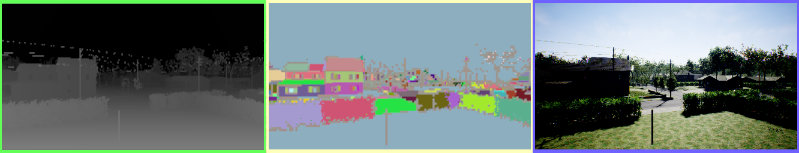

# Camera Views

The camera views that are shown on screen are the camera views you can fetch via the [simGetImages API](image_apis.md).



From left to right is the depth view, segmentation view and the FPV view. See [Image APIs](image_apis.md) for description of various available views.

## Turning ON/OFF Views

Press F1 key to see keyboard shortcuts for turning on/off any or all views. You can also select various view modes there, such as "Fly with Me" mode, FPV mode and "Ground View" mode.

## Controlling Manual Camera

You can switch to manual camera control by pressing the M key. While manual camera control mode is selected, you can use the following keys to control the camera:
|Key|Action|
---|---
|Arrow keys|move the camera forward/back and left/right|
|Page up/down|move the camera up/down|
|W/A/S/D|control pitch up/down and yaw left/right|
|Left shift|increase movement speed|
|Left control|decrease movement speed|

## Configuring Sub-Windows

Now you can select what is shown by each of above sub windows. For instance, you can choose to show surface normals in first window (instead of depth) and disparity in second window (instead of segmentation). If the selected camera image type is configured with `ProjectionMode: "Equirectangular"`, the subwindow displays a 2:1 equirectangular preview for that image type. Below is the settings value you can use in [settings.json](settings.md):

```
{
  "SubWindows": [
    {"WindowID": 1, "CameraName": "0", "ImageType": 5, "VehicleName": "", "Visible": false},
    {"WindowID": 2, "CameraName": "0", "ImageType": 3, "VehicleName": "", "Visible": false}
  ]
}
```

## Performance Impact

Subwindows add render work for every visible camera view. Perspective and orthographic subwindows reuse the existing 2D camera render target. Equirectangular subwindows render the configured cube capture and unwrap it to a 2D preview target on the GPU, so they are heavier than a normal 2D subwindow at the same output height.

For best runtime performance, keep only the subwindows needed for the current run visible, avoid enabling multiple high-resolution equirectangular image types on the same camera, and prefer the image APIs when exact depth, segmentation, infrared, annotation, disparity, or optical-flow data is required.
