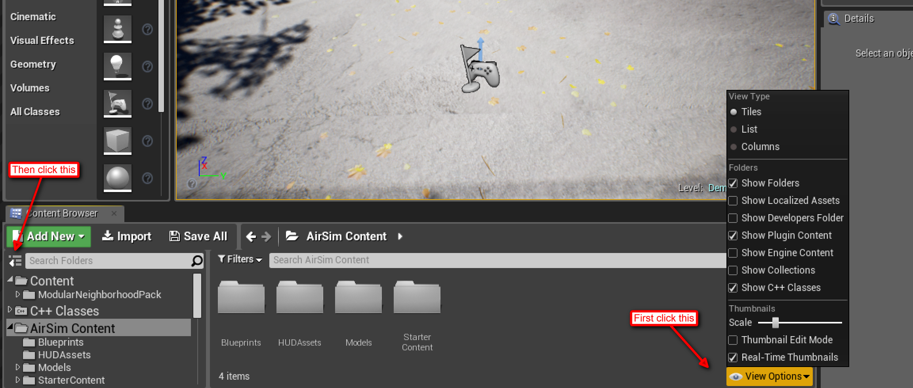

# How to use plugin contents

Plugin contents are not shown in Unreal projects by default. To view plugin content, you need to click on a few semi-hidden buttons:

**Caution**
Changes you make in content folder are changes to binary files so be careful.
